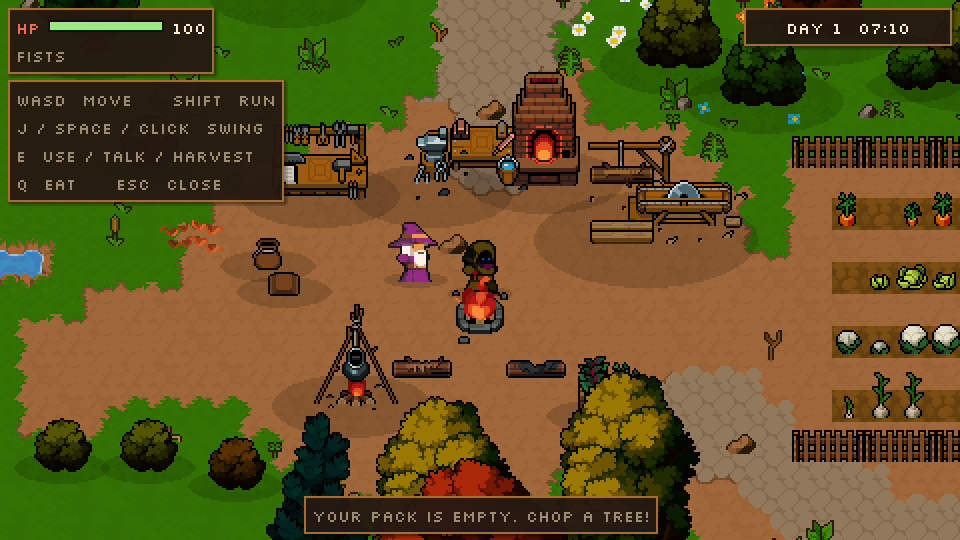
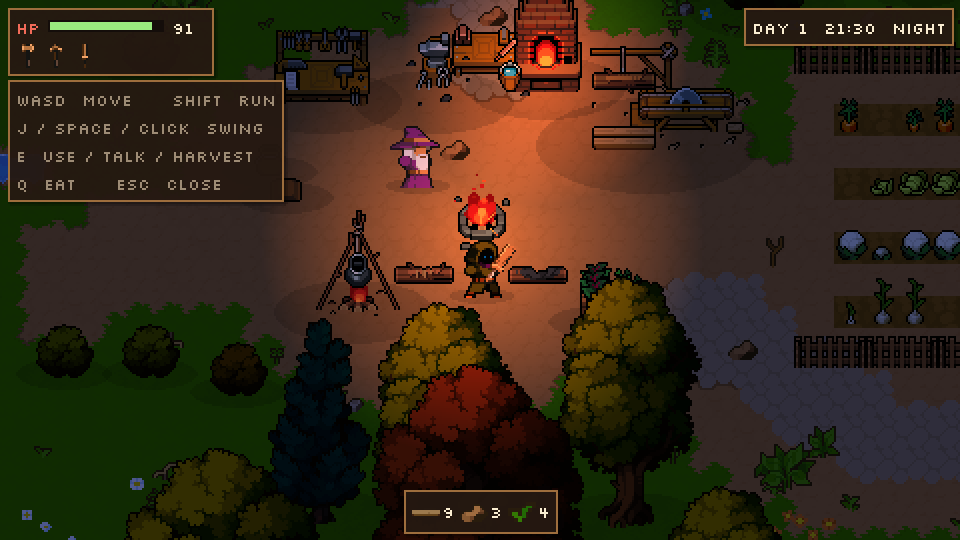
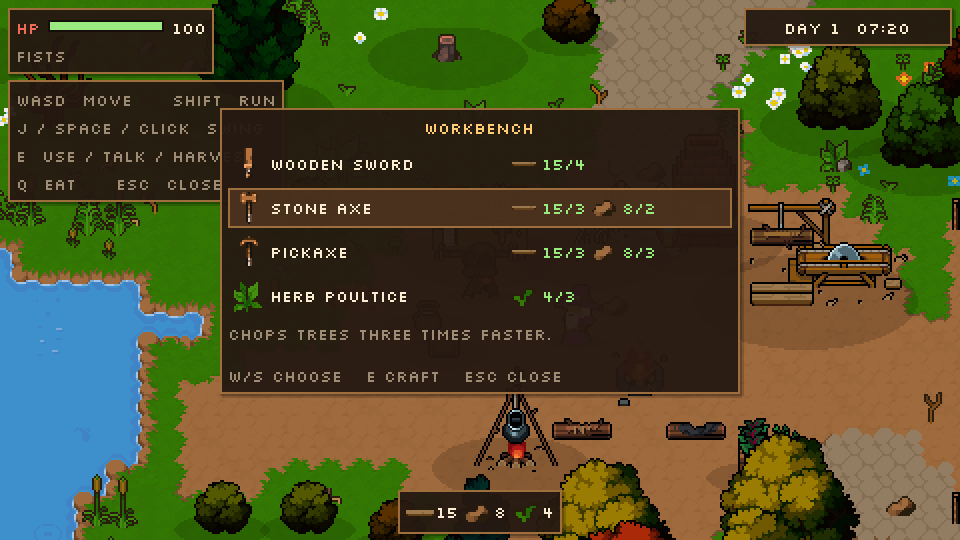
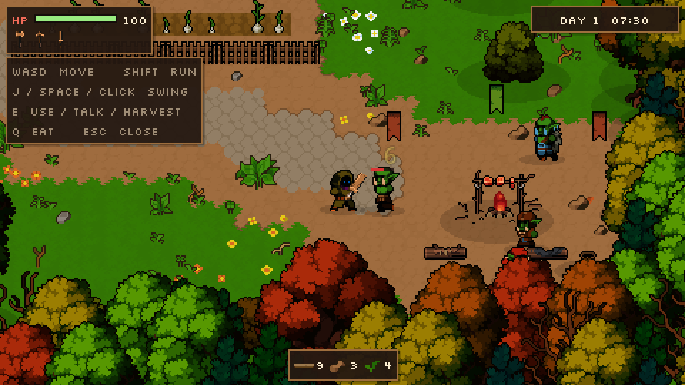

# Hearthwild

A top-down 2D game in the spirit of Stardew Valley, with more combat and Ark-style crafting, built in **Godot 4.4**. It uses the **Pixel Crawler — Free Pack** by Anokolisa for all of its art.

| | |
| --- | --- |
|  |  |
|  |  |

## Setup

1. Download the [Pixel Crawler Free Pack](https://anokolisa.itch.io/free-pixel-art-asset-pack-topdown-tileset-rpg-16x16-sprites) and unzip it into `game/assets/`, so that `game/assets/Pixel Crawler - Free Pack/Environment/` exists. The pack's terms don't allow redistributing its files, so they are not in the repo (see `assets/README.md`).
2. Open `game/project.godot` in Godot 4.4 or newer. The first open imports the pack.
3. Press **F5** to play.

## Controls

| Key | Action |
| --- | --- |
| WASD / arrows / left stick | Move |
| Shift | Run |
| J / Space / left click | Swing: attack, chop, mine |
| E / Enter / right click | Use a station, talk, harvest a crop |
| Q | Eat the food that best fits your missing health |
| Esc / Tab | Close menus |

## What's in the slice

- **The world.** An 80×50-tile map with a camp and crafting yard, a farm, a lake with animated water, a pine forest, an old graveyard, a mining field with ore and crystals, and an orc camp. It has over a thousand hand-placed and scattered props: trees, bushes, flowers, ferns, reeds, rocks, fences and banners.
- **Gathering.** Trees, rocks, ore, crystals and bushes wobble and throw chips when hit. They drop items that burst out and fly to you, leave stumps behind, and grow back. An axe chops three times faster. Iron ore needs a pickaxe.
- **Crafting.** Five stations, each with its own recipes:
  - Workbench: sword, axe, pickaxe, poultice.
  - Sawmill: planks.
  - Furnace: iron bars.
  - Anvil: bone and iron swords, buckler.
  - Cooking pot: roast meat, stew.
  
  Your gear changes damage, gathering speed and damage taken.
- **Combat.** There are eight enemy types (four orcs, four skeletons). Each one wanders near home and chases you when you get close. It flashes before it lunges, flinches when hit and dies with the pack's death animation. It drops loot and respawns later. Hits come with hit-stop, screen shake, damage numbers and knockback.
- **Farming.** Seven crops grow through four stages. Harvest ripe ones with E; they replant themselves.
- **Day and night.** A full day lasts 8 minutes. At dusk the world turns orange. At night it turns blue and the fires light up, and enemies get faster and notice you from further away.
- **NPC.** Merlo, the wizard at the camp, gives advice.

## How the world is built

Everything is data, so you (or an AI) can reshape the world without touching the editor:

- `data/world.json` holds the terrain as a grid of characters and every placed object:
  - Terrain characters: `.` grass, `:` dirt, `=` cobblestone, `~` water.
  - Each object is `{"t": sprite, "x", "y", "v": variant}`. Positions are pixels at the object's feet.
- `data/catalog.json` names every sprite, animation and item icon cut out of the pack: its sheet, region, feet anchor, shadow, collision radius and what it drops.
- `scripts/terrain.gd` autotiles the grid.
  - The pack draws each ground type as a hand-painted 5×5 "stamp", such as grass around a hole, or a grass island in water. Those stamps contain every edge and corner piece.
  - Grass and cobblestone use a cell-based match. Each cell picks the piece whose rim faces its open neighbours.
  - Water uses a corner-based (dual-grid) match, which gives shorelines in any shape. The water animates using the sheet's four frames.
  - Shapes the stamps can't draw, such as grass strips one tile wide, are opened up automatically.
  - Where the stamps offer more than one version of a piece, the one whose pixels line up best with its neighbours is used.

To change the layout, edit `tools/make_world.py` and run it (plain Python, no packages), or edit `world.json` directly:

```bash
python3 tools/make_world.py          # rewrites data/world.json (optional seed argument)
python3 tools/build_catalog.py       # only if you change sprite regions; needs Pillow
```

## Project layout

```
game/
  project.godot     480x270 pixel-perfect viewport, integer scaling, GL Compatibility renderer
  scenes/main.tscn  a single World node; everything else is built from data at startup
  scripts/
    pack.gd         cuts sprites, animations, icons and the slash effect out of the pack
    terrain.gd      the autotiler
    world.gd        spawns the level, props, lights, drops and floating text
    player.gd       movement, swinging, gathering, eating, dying and waking up
    enemy.gd        wander, chase, telegraph, lunge, flinch, die, respawn
    harvestable.gd  trees, rocks, ore, crystals and bushes
    station.gd      crafting stations        inventory.gd  items, recipes, gear
    crop.gd         farming                  npc.gd        talking characters
    hud.gd          health, clock, gear, items, dialogue, crafting menu
    daynight.gd     time-of-day tint and fire light
    demo.gd         scripted tour for automated screenshots
  tools/            make_world.py, build_catalog.py
  ui/               Silkscreen pixel font (SIL Open Font License)
```

For a scripted tour that saves screenshots as it goes:

```bash
godot --path game -- --demo --shots=/tmp/hearthwild
```

## Limits of the free pack and what's next

- In the free pack, the three heroes and the monsters only have idle, run and death animations. Attacks are shown as a swing of the held weapon plus the pack's slash effect. The tool animations (chop, mine, water, fish) exist only for the pack's unclothed base body. The paid Pixel Crawler packs add more characters and actions.
- The pack has no sound. Audio would need a separate pack.
- Not built yet: saving and loading, building walls and floors, an inventory screen, and more NPCs and quests. The NPC dialogue is written so it could be handed to Claude the way the Reverie engine does for its characters.
