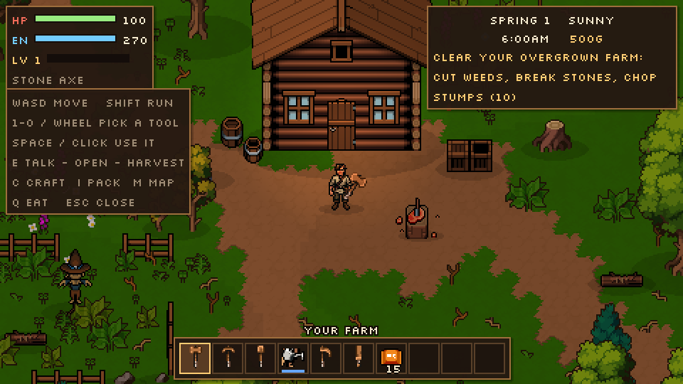
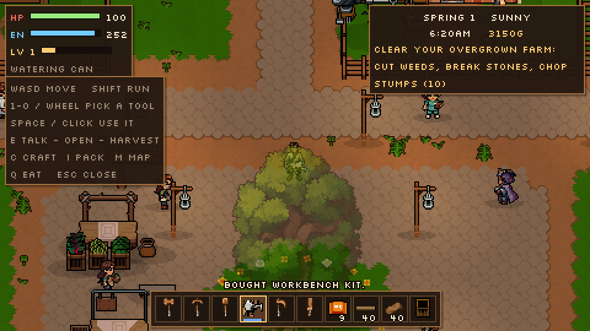
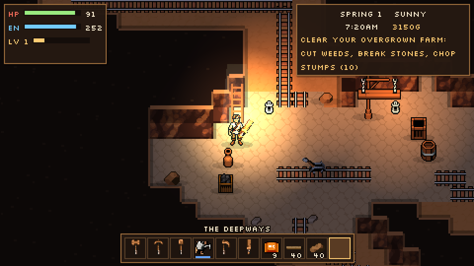
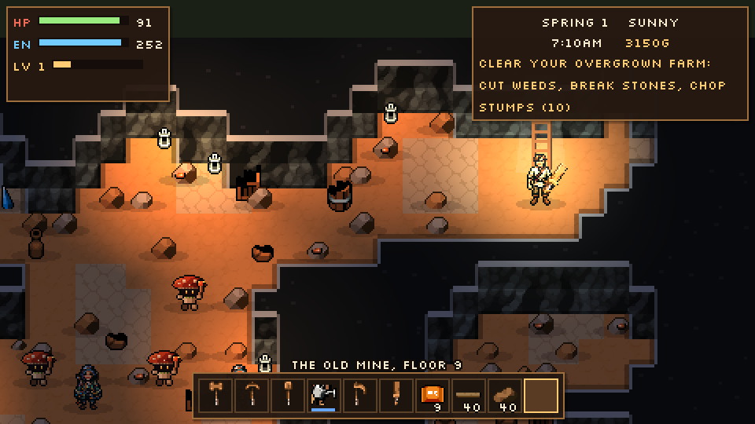
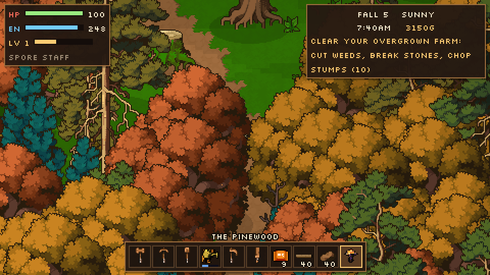
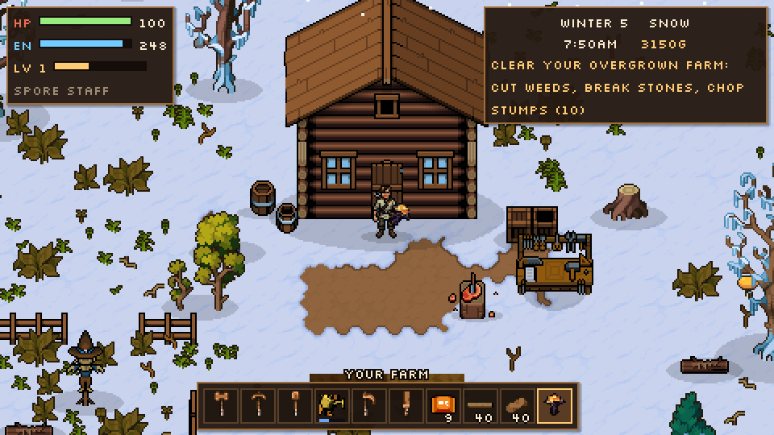
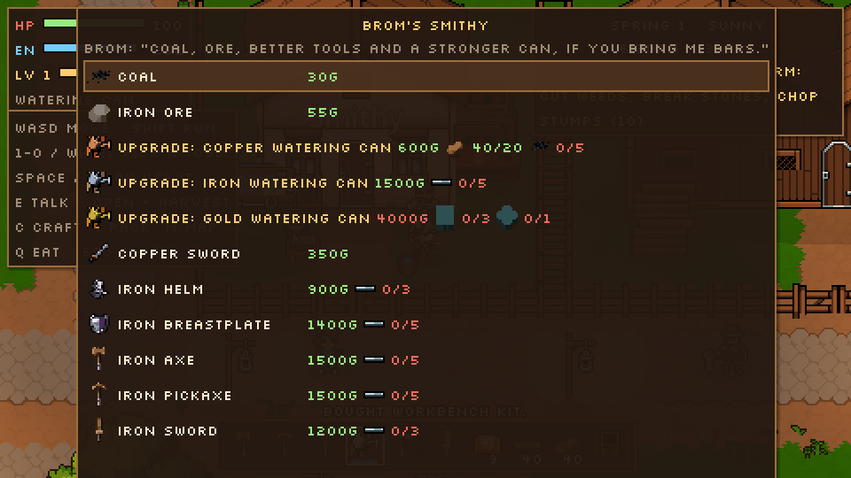
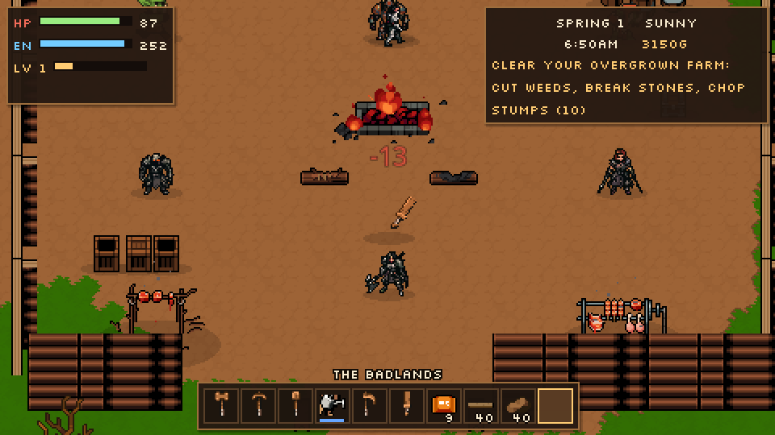

# Hearthwild

A cosy-but-dangerous farming game in **Godot 4.4**, in the spirit of Stardew Valley with deeper crafting. You start on an overgrown plot with a one-room cabin, a few tools and fifteen carrot seeds. From there you clear the land, grow and ship crops, buy and set up crafting stations, rebuild the house, and explore a valley of towns, woods, mountains, mines and the old railway under it all.

The world art comes from the **Pixel Crawler — Free Pack** by Anokolisa. The people and monsters come from **PixelLab**: 88 characters and 5 creatures, with real 4-direction walk cycles.

| | |
| --- | --- |
|  |  |
|  |  |
|  |  |
|  |  |

## Setup

1. Download the [Pixel Crawler Free Pack](https://anokolisa.itch.io/free-pixel-art-asset-pack-topdown-tileset-rpg-16x16-sprites) and unzip it into `game/assets/`, so that `game/assets/Pixel Crawler - Free Pack/Environment/` exists. The pack's terms don't allow redistributing its files, so they're not in the repo. The PixelLab art is in the repo (`assets/pixellab_*`).
2. Open `game/project.godot` in Godot 4.4 or newer. The first open imports everything.
3. Press **F5**. The game saves every time you sleep. Add `-- --new` to the command line to ignore the save.

## Controls

| Key | Action |
| --- | --- |
| WASD / arrows / left stick | Move |
| Shift | Run |
| 1–0, mouse wheel | Pick a toolbar slot |
| Space / J / left click | Use the selected item (swing, till, water, plant, set up a kit, shoot) |
| E / Enter / right click | Talk, open, harvest, drink, ride, go through doors |
| C | Hand crafting |
| I / Tab | Pack, stats and home |
| M | Map of the area you're in |
| Q | Eat the food that best fits what you're missing |
| Esc | Close menus |

## Playing

### Your farm

You wake up in a log cabin on your farm. Every tile outside is overgrown with weeds, stones, fallen branches, stumps, young trees, boulders and old logs. Whatever you clear on the farm stays cleared. Big stumps and fallen logs need an iron axe, and boulders need a pickaxe.

- **Farming.** Till with the hoe, plant seeds, and water every day. Refill the can at any water. A crop grows one day for each day it was watered, and withers if it's out of season.
- **The watering can** is upgraded at Brom's smithy, and each upgrade changes its colour:

  | Can | Holds | One pour waters |
  | --- | --- | --- |
  | Plain | 40 | 1 tile |
  | Copper | 55 | 3 tiles in a line |
  | Iron | 70 | 5 tiles in a line |
  | Gold | 100 | a 3×3 patch |

- **The shipping crate** by your door takes anything that sells. The carter pays overnight, and a morning report shows what you earned.
- **Energy.** Tools cost energy. Food, sleep and the hidden springs in the woods restore it.
- **Stations.** You buy them as kits from Tilda and set them up anywhere on the farm. The workbench, sawmill, furnace, anvil and cooking pot each upgrade twice.
- **Your house.** Tilda rebuilds it twice, for gold and materials, overnight. The log cabin becomes a timber cabin with a kitchen, then a farmhouse with an alchemy bench.
- **The wardrobe** in your house switches between your four PixelLab player characters.

### The calendar

Each of the four seasons lasts 28 days, and the seasons change the land:

- Oaks and bushes turn gold and red in fall.
- Winter lays snow over the ground and frosts the trees.

The weather follows the date: sun, rain (which waters your crops), storms with lightning, wind, and snow. Brindle holds four festivals in its square: the Blossom Fair, the Midsummer Bonfire, the Harvest Fair and the Night of Lanterns.

### The valley

The valley is split into areas that load one at a time, the way Stardew's are. Walk off the edge along a path to go to the next one. Each area remembers what you chopped, broke and killed; wild things grow back after a few days.

| Area | What's there |
| --- | --- |
| **Your farm** | The cabin, the crate, a pond, and a lot of clearing to do |
| **Brindle** | Pella's general store (seasonal seeds), Tilda's carpentry (kits, fences, house upgrades), Brom's smithy (ore, tools, armour, can upgrades), the inn, the churchyard, the square, the Deepways shaft |
| **The Pinewood** | Mixed woods turning to old pine, a woodcutter's camp, a lake, a ruin, a hidden spring |
| **The Oldwood** | Dense old forest, a brook, the haunted Hollow, a spring, a hedge witch |
| **The Riverlands** | Meadows, Mirror Lake, Reedwater and its jetty, farms, goats |
| **The Mountain** | Snow thickening as you climb, a tarn, the quarry, the Old Mine, the Deepways mouth |
| **The Summit** | Deep snow, frozen trees, crystal, the Frost Shrine, a hot spring |
| **The Badlands** | Dry country, the Grimtusk stockade, an abandoned farmstead |
| **Stonegate** | A walled town with a market and its own Deepways shaft |

**Forests are made to look grown, not placed.** Trees follow a density field, so there are thickets and glades. Species blend across biomes. The thickest woods and the map's rim are walls of trees you can't cut, and paths wind through them. Lakes are built from irregular lobes. Weeds, stones and fallen branches lie in clumps, and chests and springs are tucked deep in the woods.

### Under the valley

- **The Old Mine** (on the Mountain) is made fresh every day. Each floor is a cave of chambers and passages full of rock, coal, iron and, deeper down, crystal.
  - Monsters get tougher the deeper you go.
  - The ladder down is hidden under a rock.
  - Every fifth floor has a lift you can ride straight back to.
- **The Deepways** is the old mine railway, one long cave that links stations under Brindle, Reedwater, the Mountain and Stonegate.
  - You can walk it end to end, past side caverns: a crystal grotto, an ore vein, an old dig, and the camp of the Deep Company.
  - Every station's cart is broken at first, each for its own reason. Fixing one is a small quest: bring materials, or clear out what's in the way.
  - A working cart takes you to any other working station.

### People and fighting

Brindle, Reedwater and Stonegate are full of PixelLab characters: shopkeepers, the mayor, a busker, the doctor, schoolchildren in the park, farmers, divers, guards. They face you when you talk to them and walk with their own animations.

The same cast's darker half is what you fight: cultists and hexers in the Oldwood's Hollow, berserkers and zealots in the badlands, the Deep Company underground, plus yetis, golems, treants, goblins and slimes.

- PixelLab drew walks for these characters but no attacks, hits or deaths. Those are acted out in code rather than faked frame by frame: the body leans back to wind up, lunges with a slash, recoils when hit and topples when it dies.
- The Pixel Crawler orcs and skeletons keep their own drawn animations.
- **Weapons:** swords from wood to sunforged, a hunter's bow and a spore staff that fire projectiles.
- **Armour:** shields, an iron helm and breastplates of iron or mythril.

## How the world is built

Everything is data, so the world can be reshaped without the editor, by hand or by an AI.

- **`tools/make_world.py`** generates every area with the modules in `tools/worldgen/`:
  - `core.py`: noise, Poisson-disc sampling, lakes, trails and bridges.
  - `nature.py`: woods, debris, springs and hidden chests.
  - `build.py`: houses, fenced lots, yards and the churchyard.
  - One module per group of areas.

  Each area is written to `data/areas/<id>.dat` (zlib JSON: objects in 32×32-tile chunks, fences, exits, spawns, the terrain string). The ground is baked to `<id>.bin` and `<id>_winter.bin` by `tools/terrain_bake.py`, in the byte format of Godot's `TileMapLayer`. A final check walks each area from its entrances and reports any chest, spring or person you couldn't reach.
- **`tools/pixellab/import_actors.py`** turns PixelLab's exports (`assets/pixellab_npcs/`) into game atlases (`assets/pixellab_actors/`) and catalog entries:
  - Characters are shrunk to the Pixel Crawler scale with `pixelscale.py`. Each new pixel takes the colour covering most of its area, and the outline is restored, so faces and line work survive where nearest-neighbour would drop them.
  - The turnaround becomes a breathing idle, and PixelLab's walk cycles are kept as drawn.
- **`data/catalog.json`** names every sprite, animation and icon: sheet, region, feet anchor, shadow, collision, drops and light. `tools/build_catalog.py` rebuilds the Pixel Crawler part.
- **Caves** are drawn by `scripts/cave_rock.gd`: dark rock overhead, the pack's rock texture as wall faces wherever the floor lies to the south, lit lips and soft shadows along every edge. The mines and the Deepways share it.

```bash
python3 tools/make_world.py                       # every area (or name some: farm town deepways)
python3 tools/pixellab/import_actors.py           # PixelLab exports -> game atlases
godot --path game -- --demo --new --area=farm --mapshot=/tmp/farm.png --mapscale=2
godot --path game -- --demo --new --area=town --mapshot=/tmp/sq.png --region=40,44,30,22
godot --path game -- --demo --new --shots=/tmp/tour        # scripted tour with screenshots
godot --path game -- --demo --new --gallery=/tmp/anims     # a strip of every character's animations
```

## Project layout

```
game/
  project.godot        480x270 pixel-perfect viewport, integer scaling, GL Compatibility renderer
  scenes/main.tscn     a single World node; everything else is built from data
  scripts/
    game.gd            calendar, weather, festivals, gold, energy, per-area memory, goals, sleep, save
    inventory.gd       items, toolbar, recipes, shops, crops and prices, armour, the watering can
    world.gd           loads one area at a time, exits, seasons on sprites, streaming, placing kits
    terrain.gd         the baked ground and cliffs      cave_rock.gd   caves (mines, Deepways)
    mine.gd            procedural Old Mine floors       ladder.gd      ladders up and down
    minecart.gd        Deepways cart stops and their repair quests
    fences.gd gate.gd  post-and-rail fences and gates   deck.gd  bridges and jetties
    house.gd           house fronts (and shaft doors)   interior.gd  your house, per tier
    soil.gd crop.gd    tilled soil and crops            ship_crate.gd  the shipping crate
    player.gd          you: toolbar, tools, weapons, the wardrobe
    enemy.gd           everything that fights           npc.gd  villagers and shopkeepers
    projectile.gd      arrows and spore bolts           spring.gd  hidden springs
    hud.gd             status, toolbar, menus, shops, shipping, map, dialogue, fades
    pack.gd            cuts sprites, animations and icons out of the art
    daynight.gd ambience.gd  light, weather, particles
    demo.gd            scripted tour, area renders, the animation gallery
  tools/               make_world.py, worldgen/, terrain_bake.py, build_catalog.py, pixellab/
  assets/              pixellab_npcs (PixelLab exports), pixellab_actors (game atlases), pixellab_items,
                       pixellab_tilesets, expansion (the Myconid); the Pixel Crawler pack goes here too
  ui/                  Silkscreen pixel font (SIL Open Font License)
```

## What the art doesn't cover yet

- **Fighting animations for the PixelLab cast.** PixelLab can animate attacks, hits and deaths, and that's the next step: `tools/pixellab/import_actors.py` already picks up any extra animation rows in an export.
- **Creature walk cycles.** The five creatures (treant, goblin, slime, yeti, golem) only have turnarounds so far, so they waddle in code until their walk cycles exist.
- **Farm animals.** The goat is the only animal with art, so coops and barns are still to come.
- **Sound.** Neither pack has any.
