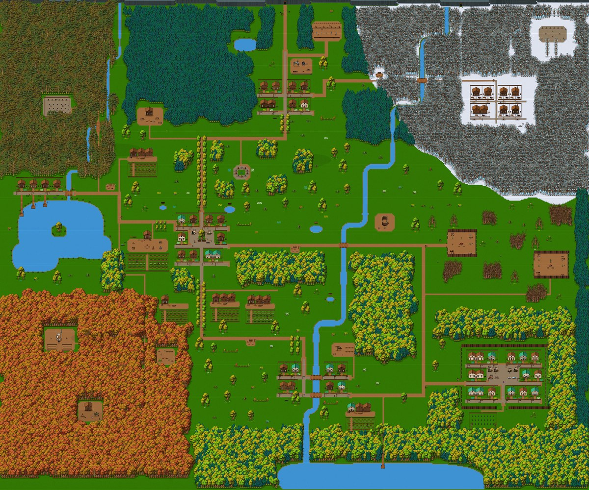
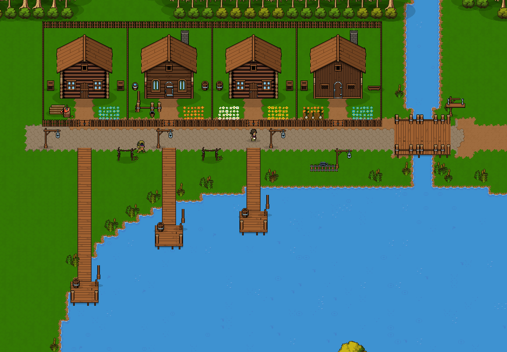
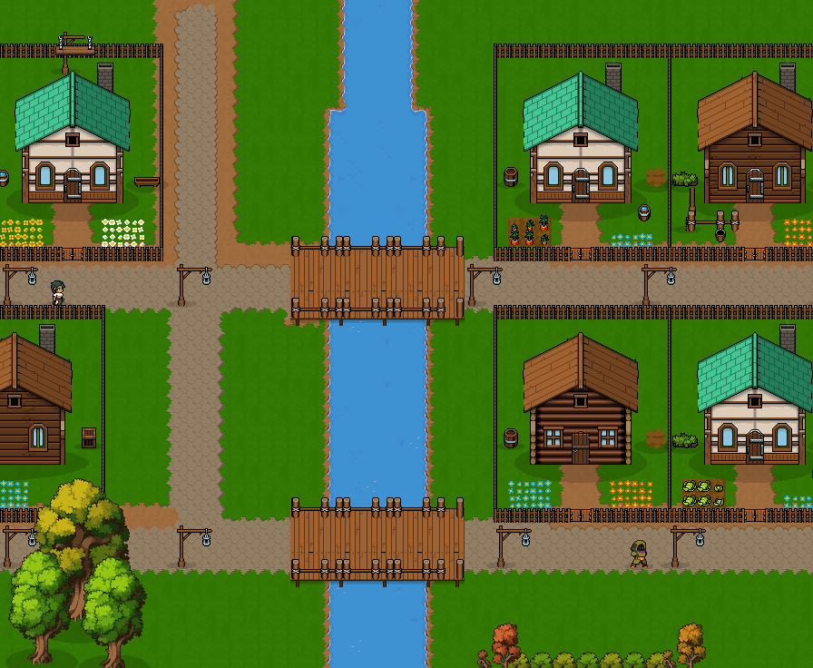
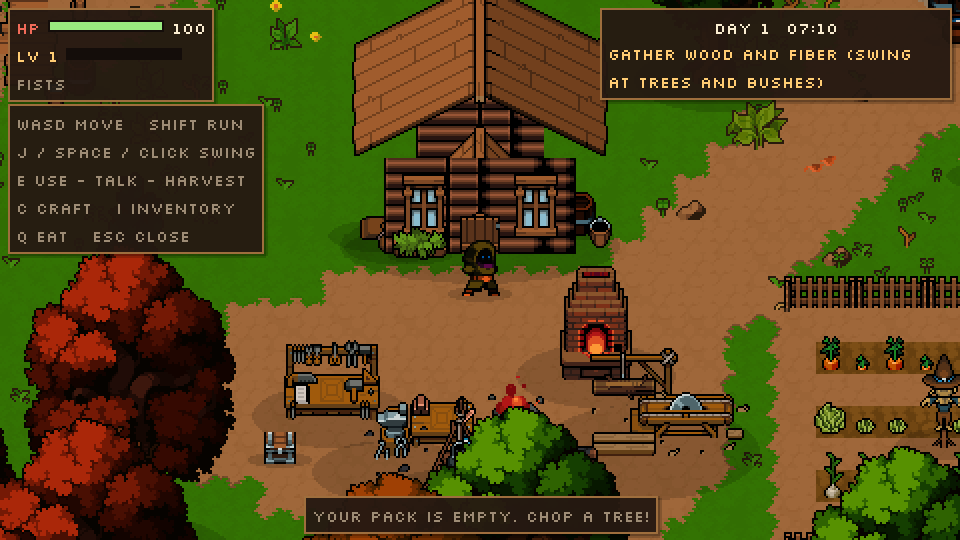
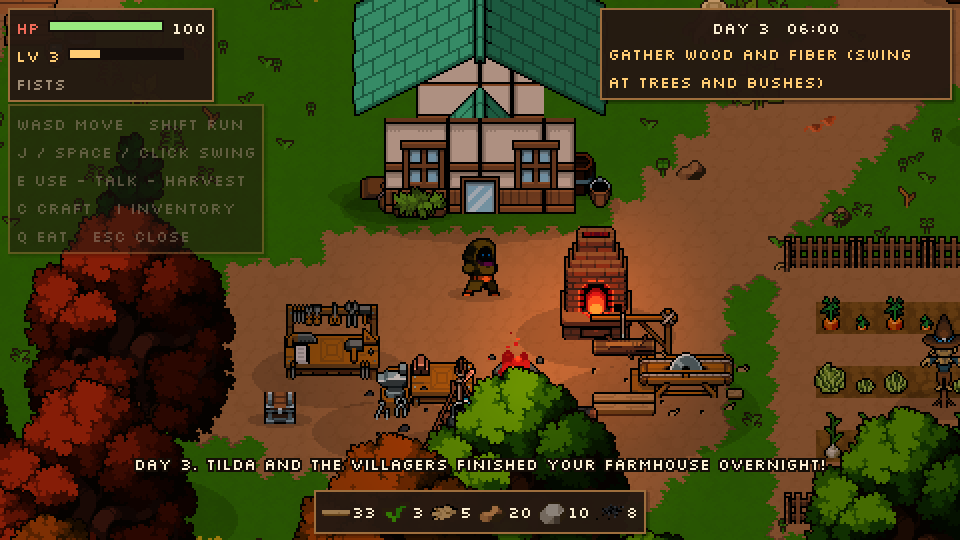
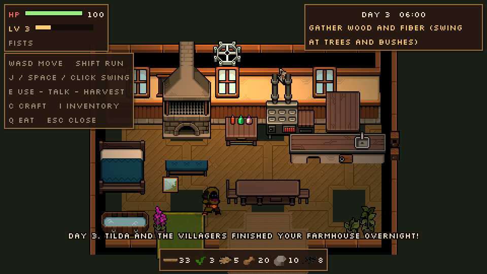
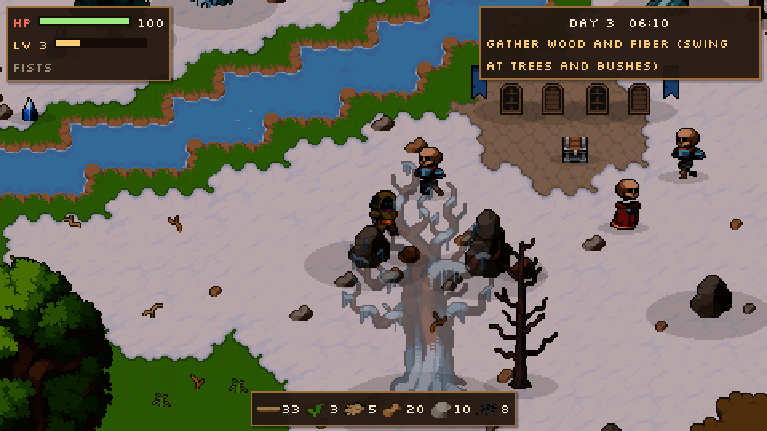

# Hearthwild

A cosy-but-dangerous top-down game in **Godot 4.4**. Mend your cabin, farm, and build up a deep crafting tree, in the style of Stardew Valley with Ark-style crafting. Explore a 600×500-tile valley with seven settlements, and fight orcs and skeletons. All the art comes from the **Pixel Crawler — Free Pack** by Anokolisa.



| | |
| --- | --- |
|  |  |
|  |  |
|  |  |
|  |  |

## Setup

1. Download the [Pixel Crawler Free Pack](https://anokolisa.itch.io/free-pixel-art-asset-pack-topdown-tileset-rpg-16x16-sprites) and unzip it into `game/assets/`, so that `game/assets/Pixel Crawler - Free Pack/Environment/` exists. The pack's terms don't allow redistributing its files, so they're not in the repo.
2. Open `game/project.godot` in Godot 4.4 or newer. The first open imports the pack.
3. Press **F5**. The game saves every time you sleep. Add `-- --new` to the command line to ignore the save.

## Controls

| Key | Action |
| --- | --- |
| WASD / arrows / left stick | Move |
| Shift | Run |
| J / Space / left click | Swing: attack, chop, mine, break crates |
| E / Enter / right click | Use: doors, stations, beds, people, crops, chests, signs, forage |
| C | Hand crafting |
| I / Tab | Pack, stats and home |
| M | Map of the valley |
| Q | Eat the food that best fits your missing health |
| Esc | Close menus |

## The game

### Your cabin

Your home is a cabin by the lake. You walk inside through the door. Tilda, the carpenter in Brindle, rebuilds it in two stages from materials you bring her. The work happens overnight, so sleep and wake up to a new house.

| Tier | Outside | Inside | Unlocks |
| --- | --- | --- | --- |
| Log Shack | Log walls, plank roof | One room, bed, table, wardrobe | Sleeping and saving |
| Timber Cabin | Plank walls, chimney | Brick fireplace, kitchen stove, long table | Kitchen recipes |
| Farmhouse | Plaster and timber, green tile roof | Stone fireplace, kitchen with sink, bath, alchemy bench | Tonics |

Sleeping in your bed ends the day, restores your health, regrows forage and saves the game. Stay out past 2 AM and you collapse and wake up at home.

### Crafting

Crafting is a tree, not a flat list, and every tool is made from things you made first.

```
wood ──sawmill──▶ planks, sticks ─┐
fiber ──hands──▶ twine ──bench──▶ cloth
stone + stick + twine ──bench──▶ stone axe / pickaxe
iron ore + coal ──furnace──▶ iron bar ──anvil──▶ nails, iron tools, iron sword, iron shield
stone + coal ──furnace──▶ bricks          iron bar + coal ──furnace──▶ steel ──anvil──▶ steel sword
crystal (iron pickaxe) ──furnace──▶ glass ──▶ lantern, tonics, farmhouse windows
herbs, mushrooms, meat, crops, bones, resin ──pot / kitchen / alchemy──▶ food and tonics
```

- **Stations.** There are eight: hand crafting, workbench, sawmill, furnace, anvil and cooking pot in the yard, plus the kitchen and alchemy bench inside your upgraded house.
- **Levels.** Recipes unlock as your crafting level rises. Crafting, gathering, finishing goals and winning fights all give XP.
- **Tools set what you can gather.**
  - Axes chop 3× (stone) or 5× (iron) faster.
  - Iron ore needs a pickaxe, and crystal needs an iron one.
- **Side products keep the tree turning.** Pines drop resin, bushes drop herbs, rocks drop coal, crystal sometimes drops gems, and skeletons drop bones.
- **Gear.**
  - Swords set your damage: wood 6, bone 10, iron 14, steel 20.
  - Shields reduce damage taken.
  - The lantern lights your way at night.
  - Tonics give might (+50% damage) or haste (+30% speed).

### The valley

The map is 600×500 tiles, about five times the combined outdoor maps of Stardew Valley. It takes a couple of minutes to walk across, so every town has a **minecart stop**: use one once and you can ride between any stops you've found. **M** shows the map.

- **Brindle,** the starting village: three streets of fenced house lots, a square round an old oak with market stalls, the Brass Kettle tavern, Tilda's workshop, Merlo, Captain Brann.
- **Your homestead,** west of Brindle: the cabin, a crafting yard with room for every station tier, fenced fields, an orchard.
- **Reedwater,** a fishing hamlet on Mirror Lake, with piers and an island chest.
- **Ironridge,** the mining town under the mountains, with an open-air forge, the quarry and the Old Mine.
- **Frosthold,** the snow town on the pass, with fire barrels on every corner, the Frost Mine and the Frost Shrine.
- **Millbrook,** built across the Great River on two bridges, with a lumber mill.
- **Stonegate,** the walled market town in the south-east, with the chapel yard outside its wall.
- **Farms** between the towns, each with a farmhouse, a barn, fenced fields and scarecrows.
- **Wild places:** the old pinewood and its graveyard, the pine hills and the hunters' lodge, the highland meadows and stone circle, the autumn woods with the woodcutters' camp, the witch's hut and the ruined farmstead, a ruined watchtower, travellers' rests along the roads, and orc country with Grimtusk's stockade and the warlord's camp.

**Combat.** There are eight enemy types. They wander, chase, flash before they lunge, flinch when hit, drop loot and come back later. At night they're faster and see further.

**Goals.** A short chain of goals in the corner leads you from your first log to a steel sword and the Frostvale shrine.

**Ambience.** Cloud shadows drift over by day. Fireflies come out at night, and leaves fall in the thick woods. Lamps, the furnace, campfires and the cabin fireplace light up after dark.

## How the world is built

Everything is data, so the world can be reshaped without the editor, by hand or by an AI.

### `tools/make_world.py`

This generates the world (plain Python, no packages). It blocks the valley out the way a level designer would, and nothing is scattered at random:

- **Roads** are straight runs with square turns. **Rivers** run in straight reaches joined by round bends, and **lakes** are rounded, so the pack's shore tiles draw clean banks.
- **Settlements** are planned on street grids. Every house stands on a fenced lot facing its street, with a gate in line with the door, a path, and a front yard dressed from a set of plans (flower beds, a vegetable patch, a washing line, a woodpile, herbs, young fruit trees). In the snow, yards get firewood and fire barrels instead.
- **Forests** are dense masses on a staggered lattice, one tree family per wood, with edges that wander in and out. The two rows at the edge can be chopped; the deep trees form the forest wall. Tree crowns are kept from hiding anything laid out behind them.
- **The open country** gets small planned scenes on a loose grid where there's room: groves, hedgerows, rock outcrops, stump clearings, wildflower beds, landmark oaks and ponds.
- **Bridges** reach onto both banks and have rope railings. **Piers** end in a landing with mooring posts.
- A final check reports any prop that landed on a fence, in water or inside a house.

It writes three files:

- **`data/world.dat`:** zlib-compressed JSON with the cliffs, fences, points of interest, water collision boxes, the things that always exist (people, stations, minecart stops, bridges) and every other object, split into 32×32-tile chunks.
- **`data/world_tiles.bin`:** the ground, baked tile by tile by `tools/terrain_bake.py` into the byte format of Godot's `TileMapLayer.tile_map_data`, so the whole map loads at once.
- **`data/world_map.png`:** the in-game map.

### `data/catalog.json`

This names every sprite, animation and icon cut out of the pack: sheet, region, feet anchor, shadow, collision, drops and light. `tools/build_catalog.py` rebuilds it and needs Pillow.

### The ground: `tools/terrain_bake.py` and `scripts/terrain.gd`

The baker autotiles the map from the pack's hand-painted 5×5 ground "stamps":

- Grass, cobblestone and snow drifts use a cell-based match. The pack draws these as holes or islands.
- Water shorelines use a corner-based (dual-grid) match and animate.
- Among a piece's variants, it picks the one whose edge pixels line up with the neighbours already placed, so rims run on without seams.

`terrain.gd` loads the baked layers and stretches the cliffs from the pack's 6-wide plateau stamp, each one Y-sorted so it hides what stands behind it. The Old Mine and the Frost Mine use the cliff variant with a timber-framed opening set into the face.

### Streaming

`world.gd` only keeps the part of the map around the player alive. Chunks near the player are spawned a slice per frame, and they're freed once the player is well away. Flat ground dressing in a chunk is drawn by a single node. Anything chopped, broken or killed stays gone until morning, even if its chunk unloads.

### Fences, gates, bridges

- **`fences.gd`** cuts the pack's fence stamp into pieces and autotiles picket fences (light and dark) with every corner, tee and end, Y-sorted and solid.
- **`gate.gd`** hangs a two-leaf gate in each gap; the leaves swing back when you walk up.
- **`deck.gd`** builds bridges and piers from a clean block of the pack's deck boards.

### Buildings

These are assembled from the pack's pieces:

- **House fronts** (`house.gd`): roof, gable wall, wall strip, door, windows and chimney.
- **Cabin interiors** (`interior.gd`): interior wall and floor sets plus kitchen and bedroom furniture.

To regenerate the world:

```bash
python3 tools/make_world.py              # rewrite data/world.dat, world_tiles.bin and world_map.png
godot --path game -- --demo --new --mapshot=/tmp/map.png                      # the whole map at 1:4
godot --path game -- --demo --new --mapshot=/tmp/town.png --region=172,214,64,62   # a region at 1:1 (tiles)
godot --path game -- --demo --new --shots=/tmp/tour          # scripted tour with screenshots
```

## Project layout

```
game/
  project.godot        480x270 pixel-perfect viewport, integer scaling, GL Compatibility renderer
  scenes/main.tscn     a single World node; everything else is built from data
  scripts/
    game.gd            clock, cabin tier, goals, buffs, sleep, save and load
    inventory.gd       items, the recipe tree, crafting levels, cabin upgrade costs
    pack.gd            cuts sprites, animations and icons out of the art pack
    terrain.gd         loads the baked ground, builds the cliffs
    world.gd           builds the valley, streams it in chunks, cabin doors, minecart rides, drops
    fences.gd gate.gd  autotiled picket fences and swinging gates
    deck.gd            plank bridges and piers    minecart.gd  fast-travel stops
    decor_batch.gd     one node draws a chunk's flat ground dressing
    house.gd           house fronts                interior.gd   cabin interiors per tier
    player.gd          movement, swinging, eating, the lantern, camera rooms
    enemy.gd           orc and skeleton AI         harvestable.gd  trees, rocks, ore, crystal, crates
    npc.gd             villagers, Tilda, Merlo     station.gd / cabin_fixture.gd  things you craft at
    crop.gd  forage.gd pickup.gd interactable.gd campfire.gd daynight.gd ambience.gd fx.gd
    hud.gd             status, goal, items, dialogue, crafting, pack screen, cabin plans, fades
    demo.gd            scripted tour and whole-map render
  tools/               make_world.py, terrain_bake.py, build_catalog.py
  ui/                  Silkscreen pixel font (SIL Open Font License)
```

## Limits of the free pack

- The heroes and monsters only have idle, run and death animations. Attacks are drawn as a swing of the held item plus the pack's slash effect.
- There's no sound in the pack.
- The Old Mine and the quarry tunnel are entrances only for now. Interiors for them are a natural next step, using the pack's dungeon tiles.
